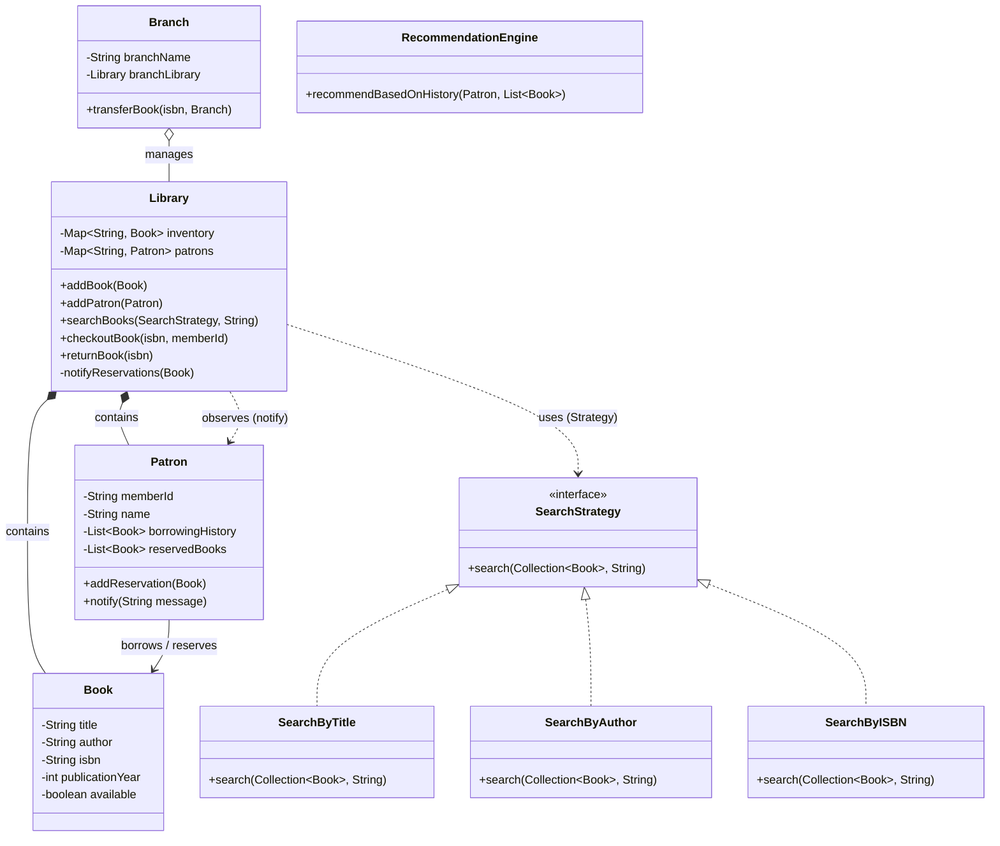

# Library Management System

A Java-based Library Management System that demonstrates Object-Oriented Programming (OOP), SOLID principles, and various Design Patterns.

## Architecture & Features

This system handles typical library operations such as inventory management, patron management, borrowing processes, search functions, branch management, and dynamic recommendations. 

### Key Features
- **Book and Patron Management:** Full tracking of members and library inventory.
- **Search Capabilities:** A flexible search system using the Strategy Pattern to find books by Title, Author, or ISBN.
- **Lending & Reservations:** Handles state transitions and checks out books securely.
- **Observer Pattern for Reservations:** When a book becomes available upon return, all patrons who reserved the book are dynamically notified.
- **Multi-Branch Support:** Supports transferring books across multiple independent library branches.
- **Recommendation Engine:** Suggests books dynamically to a patron based on their previous borrowing history frequency.

## Class Diagram



## SOLID Principles & Design Patterns

1. **Single Responsibility Principle:** `Branch` only worries about branches, `Library` orchestrates its internal inventory and patrons, and `SearchStrategy` separates search algorithms from `Library` logic.
2. **Open/Closed Principle:** By using `SearchStrategy`, the system is closed for modification but open for extension. A new search type (e.g., `SearchByGenre`) can be added without modifying `Library`.
3. **Strategy Pattern:** Used for interchangeable search algorithms and recommendations.
4. **Observer Pattern:** The `Library` orchestrates `book returns` and automatically uses the Observer Pattern to notify `Patron` instances who reserved it.

## How to Run
Navigate to `src/` direction and compile the codebase using standard javac, then run the Main class:

```bash
javac com/lms/models/*.java com/lms/search/*.java com/lms/core/*.java com/lms/recommendation/*.java com/lms/Main.java
java com/lms.Main
```
